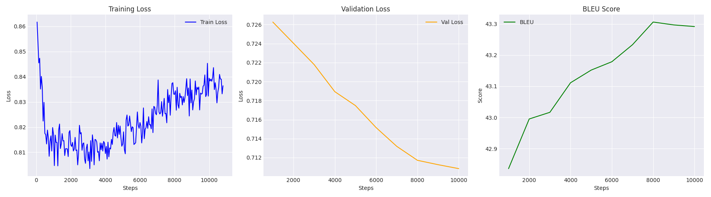

# NLP-NMT-Multilingual

  
Table of Contents

  <ol>
    <li><a href="#authors">Authors</a></li>
    <li><a href="#about-this-project">About this project</a></li>
    <li><a href="#technologies-used">Technologies Used</a></li>
    <li><a href="#datasets--models">Datasets & Models</a></li>
    <li><a href="#training-results">Training results</a></li>
    <li><a href="#demo">Demo</a></li>
    <li><a href="#contributing">Contributing</a></li>
    <li><a href="#license">License</a></li>
  </ol>

## Authors

Our group comprises three members (K68-AI UET)

1. Vũ Đức Minh - 23020401
2. Tạ Nguyên Thành - 23020437
3. Nguyễn Đức Huy - 23020376

<a href="#readme-top">back to top</a>

## About this project

This project is the required final project for the course Natural Language Processing (2526I_INT3406#) in University of Engineering and Technology (UET - VNU). It focuses on fine-tuning two models: google/mt5-base (580M) and facebook/m2m100 (480M) for the task Neural Machine Translation between four pairs of languages in both directions:
- Vietnamese - Laos (low-resource)
- Vietnamese - Khmer (low-resource)
- Vietnamese - Chinese
- Vietnamese - English

We trained all of our models on 1x NVIDIA GPU H200 SXM (141 GB VRAM) and evaluated using sacreBLEU and chrF as two main metrics. For Vietnamese - Laos and Vietnamese - Khmer, the models are trained through 4 phases:
- Phase 1: Full fine-tuning, unfreeze all layers.
- Phase 2: Freeze the entire Encoder.
- Phase 3: Freeze last half of the Encoder.
- Phase 4: Full fine-tuning, but with lower learning rate.

Subsequently, they are deployed to HuggingFace Spaces as a demo application so that anyone can give it a try, using the aforementioned languages.

<a href="#readme-top">back to top</a>

## Technologies Used

- **Python** 
- **Matplotlib** 
- **PyTorch** 
- **NumPy** 
- **HuggingFace** 
- **Tokenization**: [PyVi](https://github.com/trungtv/pyvi), [LaoNLP](https://github.com/wannaphong/LaoNLP), [khmer-nltk](https://github.com/VietHoang1512/khmer-nltk), [km-tokenizer-khmer](https://huggingface.co/khopilot/km-tokenizer-khmer), [sentencepiece](https://github.com/google/sentencepiece)

<a href="#readme-top">back to top</a>

## Datasets & Models

For Vietnamese, Laos and Khmer, we adopt the Back-translate method to get up to 700k sentence pairs.

- English: [IWSLT'15 English-Vietnamese](https://www.kaggle.com/datasets/tuannguyenvananh/iwslt15-englishvietnamese)
	- A bilingual English–Vietnamese dataset developed within the framework of the IWSLT 2015 conference, mainly consisting of conversational sentences and spoken content (TED Talks).
	- The data is of high quality and is commonly used as a benchmark for English–Vietnamese NMT models.
- Chinese: [VLSP 2022 Chinese - Vietnamese](https://huggingface.co/datasets/VLSP2023-MT/ViBidirectionMT-Eval/tree/main/VLSP2022)
	- A Chinese–Vietnamese bilingual dataset provided by the organizers of VLSP 2022, including sentences from various domains such as news and general text.
	- This dataset is used to complement model comparisons on a high-resource language pair.
- Vietnamese: [Multilingual Open Text (MOT)](https://github.com/bltlab/mot)
	- This dataset was back-translated into Vietnamese by our team to support NMT tasks from **Vietnamese → Lao** and **Vietnamese → Khmer**.
	- A multilingual dataset containing articles, audio, images, and videos.
	- For Lao and Khmer, the data consists of news articles, from which about 700,000 lines were extracted, each line being a complete sentence.
- Laos, Khmer: [Leipzig Corpora Collection](https://wortschatz.uni-leipzig.de/en/download/)
	- This dataset was back-translated by our team into Lao and Khmer to support NMT tasks from **Lao → Vietnamese** and **Khmer → Vietnamese**.
	- A Vietnamese news and press dataset from 2022 consisting of approximately 700,000 lines, where each line is a complete sentence.

For models, all of them can be found [here](https://huggingface.co/tngtwx/models)!

<a href="#readme-top">back to top</a>

## Training results

We present the result of our training, particularly in sacreBLEU and chrF.

| Model         | sacreBLEU | chrF  |
| ------------- | --------- | ----- |
| T5_vi_lo      | 23.31     | 52.58 |
| T5_lo_vi      | 42.89     | 55.69 |
| T5_vi_khm     | 29.57     | 58.41 |
| T5_khm_vi     | 42.45     | 55.43 |
| M2M100_vi_lo  | 28.72     | --    |
| M2M100_lo_vi  | 52.01     | --    |
| M2M100_vi_khm | 23.82     | --    |
| M2M100_khm_vi | 52.34     | --    |
| M2M100_vi_zh  | 36.97     | --    |
| M2M100_zh_vi  | 36.84     | --    |
| M2M100_vi_en  | 29.65     | --    |
| M2M100_en_vi  | 29.57     | --    |
For example, metrics for model T5_lo_vi (google/mt5-base for translating Laos to Vietnamese) can be seen here:

<a href="#readme-top">back to top</a>

## Demo

Click here to try the demo of the application: https://huggingface.co/spaces/tngtwx/nlp_nmt_demo

You can switch between models, translate from language A to language B, simply as that. We encourage you to try different models to see different results. After switching to a new model, please wait a few seconds for the interface to load model. 

<a href="#readme-top">back to top</a>

## Contributing

Pull requests are welcome. For major changes, please open an issue first to discuss what you would like to change.

<a href="#readme-top">back to top</a>

## License

Distributed under the MIT License.

<a href="#readme-top">back to top</a>

